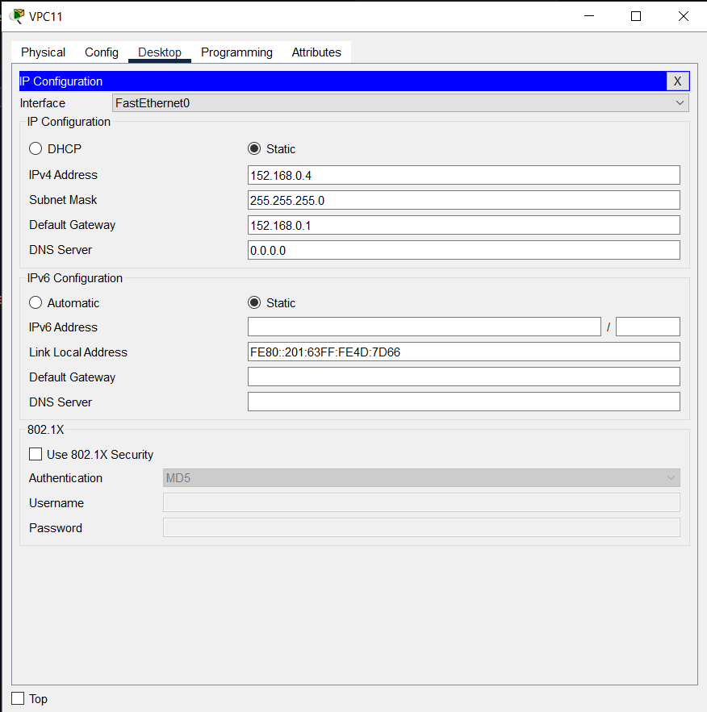
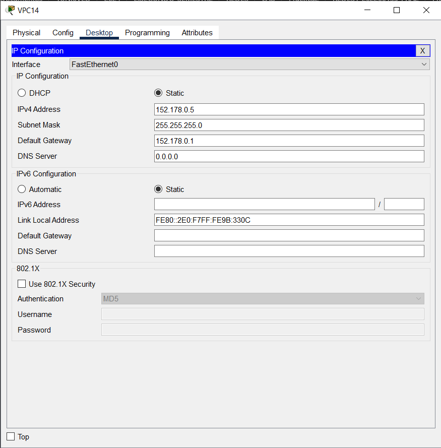
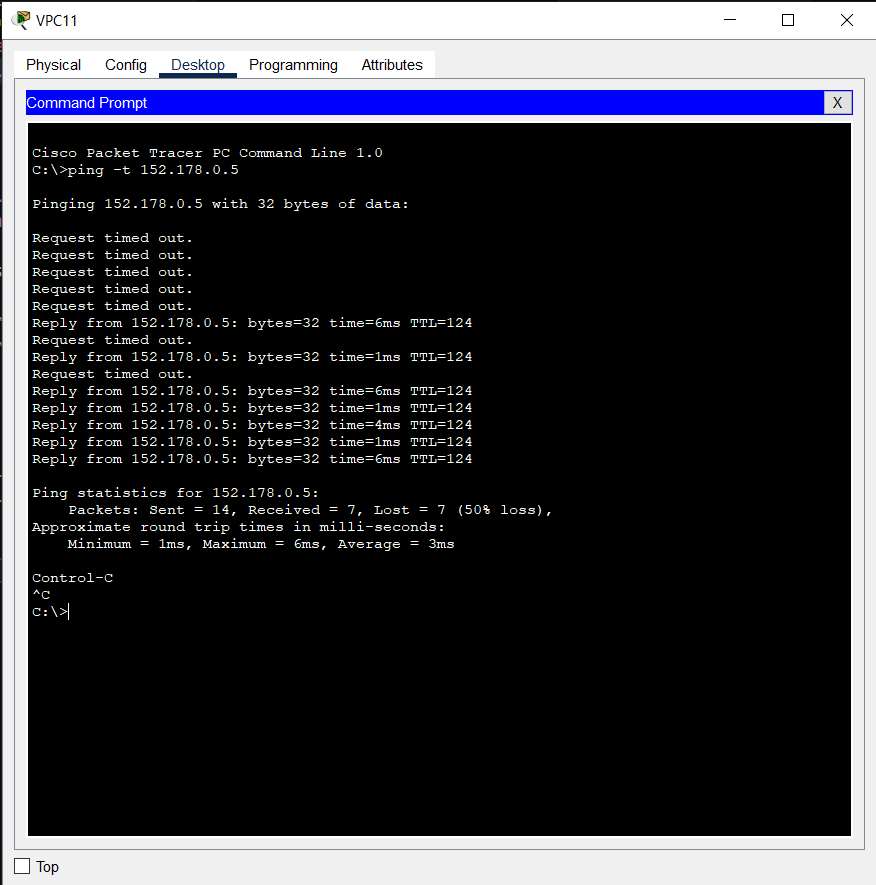

<h1 align="center">Practica 2</h1>

<p align="center"></p>

<div align="center">
🙍‍♂️ Joab Israel Ajsivinac Ajsivinac 🆔 202200135
</div>
<div align="center">
📕 REDES DE COMPUTADORAS 1
</div>
<div align="center"> 🏛 Universidad San Carlos de Guatemala</div>
<div align="center"> 📆 Segundo Semestre 2024</div>

<br/> 
<h1 align="center">📍 Manual Técnico</h1>
<br/> 

Resumen de las redes definidas:

| Dispositivo | Interfaz | IP          | Máscara de subred |
| ----------- | -------- | ----------- | ----------------- |
| R1          | s1/0     | 10.0.0.1    | /30               |
| R1          | f0/0     | 1X2.168.1.2 | /29               |
| R1          | f0/1     | 1X2.168.2.2 | /29               |
| R2          | f0/0     | 1X2.168.1.1 | /29               |
| R2          | f0/1     | 1X2.168.0.2 | /24               |
| R3          | f0/0     | 1X2.168.2.1 | /29               |
| R3          | f0/1     | 1X2.168.0.3 | /24               |
| R2-R3       | Virtual  | 1X2.168.0.1 | /24               |
| VPC11       | -        | 1X2.168.0.4 | /24               |
| VPC13       | -        | 1X2.168.0.5 | /24               |
| R4          | s1/0     | 10.0.0.2    | /30               |
| R4          | f0/0     | 1X2.178.1.1 | /29               |
| R4          | f0/1     | 1X2.178.2.1 | /29               |
| R5          | f0/0     | 1X2.178.1.2 | /29               |
| R5          | f0/1     | 1X2.178.0.2 | /24               |
| R6          | f0/0     | 1X2.178.2.2 | /29               |
| R6          | f0/1     | 1X2.178.0.3 | /24               |
| R5-R6       | Virtual  | 1X2.178.0.1 | /24               |
| VPC12       | -        | 1X2.178.0.4 | /24               |
| VPC14       | -        | 1X2.178.0.5 | /24               |

# 🛠 Configuración de Routers

## R1

### Configuración Inicial
```
Router>en
Router#conf t
Router (config) #ip domain—lookup
Router (config) #hostname R1
R1 (config) #do wr
```

### Creación de rutas Estáticas
```
R1>en
R1#conf t
R1 (config) #int f0/0
R1 (config) #ip add 152.168.1.2 255.255.255.248
R1 (config—if) #no shutdown

R1 (config—if) #exit
R1 (config) # int f0/1
R1 (config-if) #ip add 152.168.2.2 255.255.255.248
R1 (config—if) #no sh
R1 (config—if) #exit

R1 (config) #ip route 152.178.0.0 255.255.255.0 10.0.0 2
R1 (config) #ip route 152.178.1.0 255.255.255.0 10.0.0 2
R1 (config) #ip route 152.178.2.0 255.255.255.0 10.0.0 2
R1 (config) #ip route 152.168.0.0 255.255.255.0 152.168.1.1
R1 (config) #ip route 152.168.0.0 255.255.255.0 152.168.2.1
```

---

## R2

### Configuracion Inicial
```
Router>en
Router#conf t
Router (config) #ip domain—lookup
Router (config) #hostname R2
R2 (config) #do wr
```

### HSRP

```
R2>en
R2#conf t
R2 (config) #int f0/1
R2 (config) #ip add 152.168.0.2 255.255.255.0
R2 (config—if) #standby 1 ip 152.168.0.1
R2 (config—if) #standby 1 priority 150
R2 (config—if) #standby 1 preempt
R2 (config—if) #no shutdown
R2 (config—if) #exit
```

### Creación Rutas Estáticas

```
R2 (config) # int f0/0
R2 (config-if) #ip add 152.168.1.1 255.255.255.248
R2 (config—if) #no shutdown
R2 (config—if) #exit

R2 (config) #ip route 152.178.0.0 255.255.255.0 152.168.1.2
R2 (config) #ip route 152.178.1.0 255.255.255.248 152.168.1.2
R2 (config) #ip route 152.178.2.0 255.255.255.248 152.168.1.2

```
---

## R3
### Configuración inicial
```
Router>en
Router#conf t
Router (config) #ip domain—lookup
Router (config) #hostname R3
R3 (config) #do wr
```

### HSRP

```
R3>en
R3#conf t
R3 (config) #int f0/1
R3 (config) #ip add 152.168.2.1 255.255.255.248
R3 (config—if) #standby 1 ip 152.168.0.1
R3 (config—if) #no shutdown
R3 (config—if) #exit
```
### Creación de rutas Estáticas

```
R2 (config) # int f0/0
R2 (config-if) #ip add 152.168.2.1 255.255.255.248
R2 (config—if) #no shutdown
R2 (config—if) #exit

R3 (config) #ip route 152.178.0.0 255.255.255.0 152.168.2.2 
R3 (config) #ip route 152.178.1.0 255.255.255.248 152.168.2.2 
R3 (config) #ip route 152.178.2.0 255.255.255.248 152.168.2.2 
```

---

## R4

### Configuración Inicial
```
Router>en
Router#conf t
Router (config) #ip domain—lookup
Router (config) #hostname R4
R4 (config) #do wr
```

### Creación de rutas Estáticas
```
R4>en
R4#conf t
R4 (config) #int f0/0
R4 (config) #ip add 152.178.1.1 255.255.255.248
R4 (config—if) #no shutdown

R4 (config—if) #exit
R4 (config) # int f0/1
R4 (config-if) #ip add 152.178.2.1 255.255.255.248
R4 (config—if) #no sh
R4 (config—if) #exit

R4 (config) #ip route 152.168.0.0 255.255.255.0 10.0.0.1
R4 (config) #ip route 152.168.1.0 255.255.255.248 10.0.0.1
R4 (config) #ip route 152.168.2.0 255.255.255.248 10.0.0.1
R4 (config) #ip route 152.178.0.0 255.255.255.0 152.178.1.2
R4 (config) #ip route 152.178.0.0 255.255.255.0 152.178.2.2
```

---

## R5

### Configuracion Inicial
```
Router>en
Router#conf t
Router (config) #ip domain—lookup
Router (config) #hostname R5
R5 (config) #do wr
```

### HSRP

```
R5>en
R5#conf t
R5 (config) #int f0/1
R5 (config) #ip add 152.178.0.2 255.255.255.0
R5 (config—if) #standby 1 152.178.0.1
R5 (config—if) #standby 1 priority 150
R5 (config—if) #standby 1 preempt
R5 (config—if) #no shutdown
R5 (config—if) #exit
```

### Creación Rutas Estáticas

```
R5 (config) #int f0/0
R5 (config-if) #ip add 152.178.1.2 255.255.255.248
R5 (config—if) #no shutdown
R5 (config—if) #exit

R5 (config) #ip route 152.168.0.0 255.255.255.0 152.178.1.1 
R5 (config) #ip route 152.168.1.0 255.255.255.248 152.178.1.1 
R5 (config) #ip route 152.168.2.0 255.255.255.248 152.178.1.1 
```

---

## R6
### Configuración inicial
```
Router>en
Router#conf t
Router (config) #ip domain—lookup
Router (config) #hostname R6
R6 (config) #do wr
```

### HSRP

```
R6>en
R6#conf t
R6 (config) #int f0/1
R6 (config) #ip add 152.168.2.1 255.255.255.248
R6 (config—if) #standby 1 ip 152.168.0.1
R6 (config—if) #no shutdown
R6 (config—if) #exit
```
### Creación de rutas Estáticas

```
R6 (config) # int f0/0
R6 (config-if) #ip add 152.178.2.2 255.255.255.248
R6 (config—if) #no shutdown
R6 (config—if) #exit

R6 (config) #ip route 152.168.0.0 255.255.255.0 152.178.2.1 
R6 (config) #ip route 152.168.1.0 255.255.255.248 152.178.2.1 
R6 (config) #ip route 152.168.2.0 255.255.255.248 152.178.2.1 
```


# 🔧 Configuración de Switches

## PAGP
### SW0
```
Switch>en
Switch#conf t
Switch (config) #int range f0/21—22
Switch # channel—protocol pagp
Switch # channel—group 1 mode auto
Switch # do wr
```

### SW1
```
Switch>en
Switch#conf t
Switch (config) #int range f0/21—22
Switch # channel—protocol pagp
Switch # channel—group 1 mode desirable
Switch # do wr
```

## LACP

## SW2
```
Switch>en
Switch#conf t
Switch (config) #int range f0/21—22
Switch # channel—protocol lacp
Switch # channel—group 1 mode active
Switch # do wr
```

## SW3
```
Switch>en
Switch#conf t
Switch (config) #int range f0/21—22
Switch # channel—protocol lacp
Switch # channel—group 1 mode passive
Switch # do wr
```

# 💻 Configuración de VPC
## VPC11


## VPC14


# ⌨ Resumen de Comandos de verificación


### 1. **Verificación del enlace serial entre R1 y R4**

- Verificar interfaces:
  ```bash
  R1# show ip interface brief
  R4# show ip interface brief
  ```

- Comprobar conectividad con **ping**:
  ```bash
  R1# ping 192.168.1.2  # Desde R1 a R4
  R4# ping 192.168.1.1  # Desde R4 a R1
  ```

---

### 2. **Verificación del PortChannel (PAGP y LACP)**

- Verificar la configuración de **EtherChannel**:
  ```bash
  SW0# show etherchannel summary  # Para SW0
  SW1# show etherchannel summary  # Para SW1
  SW2# show etherchannel summary  # Para SW2
  SW3# show etherchannel summary  # Para SW3
  ```

---

### 3. **Verificación de HSRP en R2-R3 y R5-R6**

- Verificar estado de **HSRP** en ambos pares de routers:
  ```bash
  R2# show standby
  R3# show standby
  R5# show standby
  R6# show standby
  ```

---

### 4. **Verificación de las rutas estáticas y conectividad entre VPCs**

- Verificar las rutas estáticas:
  ```bash
  R1# show ip route
  R4# show ip route
  ```

- Comprobar la conectividad con **ping** entre VPCs:
  ```bash
  VPC11> ping 10.1.3.1  # Desde VPC11 a VPC13
  VPC12> ping 10.1.4.1  # Desde VPC12 a VPC14
  ```

- Ping de la VPC11 a la VPC14

